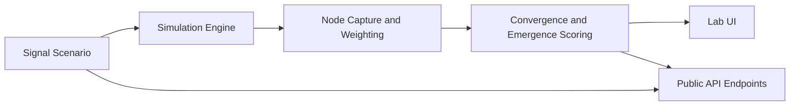
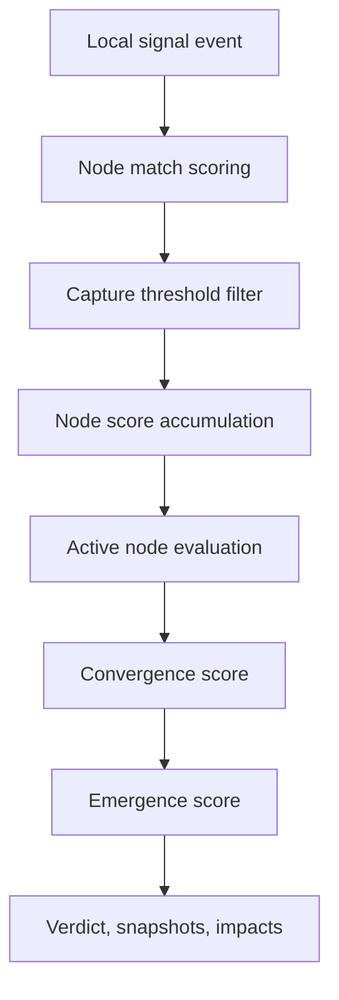

<p align="center">
  
</p>

# Synaptic Swarm Protocol MVP

Synaptic Swarm Protocol (`SYNS`) is a protocol-facing MVP for modeling how fragmented onchain signals can be transformed into emergent collective intelligence.

This repository is built around one simple principle:

> If the protocol thesis is real, the repo should already express signal ingestion, narrow node sensitivity, adaptive weighting, and emergence in code.

## Project Links

- Website: [https://www.syns.mom](https://www.syns.mom)
- X / Twitter: [https://x.com/Synaptic_Swarm](https://x.com/Synaptic_Swarm)
- GitHub Repository: [https://github.com/propooblob403/SYNS.git](https://github.com/propooblob403/SYNS.git)

## Overview

SYNS is not presented here as a complete autonomous intelligence network. This repository is a deliberately scoped MVP that turns the core narrative into a working, inspectable software surface.

The current version provides:

- a branded protocol homepage
- an interactive emergence lab
- typed protocol primitives under `lib/syns`
- deterministic signal scenarios
- a compact simulation engine
- public demo APIs for scenarios, nodes, and emergence runs
- GitHub-ready architecture and glossary documentation

The current version does **not** claim to provide:

- live chain indexing
- distributed agent orchestration
- persistent swarm memory
- production-grade signal calibration
- a live alpha oracle

## Project Highlights

- First-principles protocol MVP centered on signal formation rather than generic AI branding
- Typed domain model for events, nodes, captures, impacts, snapshots, and emergence runs
- Deterministic scenario library that makes demos reproducible and reviewable
- Interactive lab that supports autoplay, manual stepping, replay, and scenario switching
- Public JSON endpoints that expose the simulation surface for future integrations
- Clean separation between protocol model, demo UI, and documentation

## Technical Architecture

### Stack

- Framework: Next.js 15 App Router
- Language: TypeScript
- UI: React 19
- Styling: custom global CSS
- Runtime model: static and server-rendered demo surfaces with deterministic simulation logic
- API layer: Next.js route handlers
- State model: local UI state for lab interaction, deterministic protocol computation in shared library code

### Architectural Layers

1. `Presentation Layer`
   Homepage, lab page, docs page, shared header and footer, protocol branding, and visual simulator.

2. `Protocol Model Layer`
   Typed primitives such as `SignalEvent`, `SynapticNode`, `CaptureEvent`, `SignalImpact`, `EmergenceSnapshot`, and `EmergenceRun`.

3. `Scenario Layer`
   Deterministic signal stories and fixed synaptic node definitions used for reproducible runs.

4. `Simulation Layer`
   Capture scoring, adaptive weighting, threshold activation, convergence calculation, and emergence verdict generation.

5. `API Layer`
   Public JSON endpoints that expose scenarios, nodes, and simulation results.

### System Diagram



## Core MVP Modules

### 1. Homepage

**File:** `app/page.tsx`

Purpose:

- frame the protocol thesis
- present the smallest credible feature surface
- connect GitHub visitors to the lab and docs
- show scenario coverage and current MVP scope

### 2. Emergence Lab

**Files:** `app/lab/page.tsx`, `components/emergence-simulator.tsx`

Purpose:

- replay deterministic scenarios
- step forward and backward through the signal timeline
- inspect emergence score and convergence score
- surface top nodes and top signal impacts
- demonstrate that the protocol logic is inspectable rather than decorative

### 3. Protocol Domain Model

**File:** `lib/syns/types.ts`

Purpose:

- define the minimum protocol vocabulary
- make the engine and API type-safe
- ensure the narrative terms map to software primitives

### 4. Scenario Library

**File:** `lib/syns/scenarios.ts`

Purpose:

- store deterministic scenario inputs
- define protocol node profiles
- create reviewable signal sequences for demos and testing

### 5. Simulation Engine

**File:** `lib/syns/engine.ts`

Purpose:

- score event-to-node overlap
- accumulate node capture state
- evaluate threshold activation
- compute convergence and emergence
- emit explanatory artifacts such as impacts and snapshots

### 6. Demo API Surface

**Files:** `app/api/nodes/route.ts`, `app/api/scenarios/route.ts`, `app/api/scenarios/[slug]/route.ts`, `app/api/simulate/route.ts`

Purpose:

- expose protocol-facing JSON data
- support future UI, analytics, and tooling integration
- provide an external review surface for the MVP logic

### 7. Documentation Surface

**Files:** `app/docs/page.tsx`, `docs/architecture.md`, `docs/glossary.md`, `docs/demo-limitations.md`

Purpose:

- explain the system boundary
- define terminology
- clarify what is real versus what is still roadmap

## Repository Structure

```text
.
|-- app/
|   |-- api/
|   |   |-- account/
|   |   |-- markets/
|   |   |-- nodes/
|   |   |-- scenarios/
|   |   `-- simulate/
|   |-- docs/
|   |-- lab/
|   |-- globals.css
|   |-- layout.tsx
|   `-- page.tsx
|-- components/
|   |-- emergence-simulator.tsx
|   |-- protocol-logo.tsx
|   |-- site-footer.tsx
|   `-- site-header.tsx
|-- docs/
|   |-- architecture.md
|   |-- demo-limitations.md
|   `-- glossary.md
|-- lib/
|   |-- syns/
|   |   |-- engine.ts
|   |   |-- scenarios.ts
|   |   `-- types.ts
|   |-- mock-data.ts
|   |-- types.ts
|   `-- utils.ts
|-- middleware.ts
|-- public/
|   `-- syns-logo.jpg
|-- .env.example
|-- package.json
`-- README.md
```

## Protocol Flow



## Current Feature Surface

### Available today

- protocol homepage
- emergence simulator UI
- scenario switching
- autoplay and replay
- manual step forward and backward
- node trace summaries
- signal impact summaries
- public API routes
- protocol docs
- legacy route redirection to the docs surface

### Not yet implemented

- live blockchain event ingestion
- real-time social signal ingestion
- long-term protocol memory
- adaptive calibration from historical data
- authentication or operator roles
- production observability

## Public Endpoints

### `GET /api/nodes`

Returns the current synaptic node registry used by the MVP.

### `GET /api/scenarios`

Returns scenario snapshots and their current emergence metrics.

### `GET /api/scenarios/[slug]`

Returns the full scenario plus a simulation result for that scenario.

### `GET /api/simulate?scenario=<slug>&maxSignals=<n>`

Runs the simulation engine against a selected scenario, optionally truncating signal count for replay or debugging.

## Installation

### Requirements

- Node.js 20 or newer recommended
- npm 10 or newer recommended

### Install dependencies

```bash
npm install
```

## Configuration

Create a local environment file if needed:

```bash
cp .env.example .env.local
```

### Available environment variables

- `NEXT_PUBLIC_SITE_URL`
  Base application URL for local or deployed environments

- `NEXT_PUBLIC_SOLANA_NETWORK`
  Reserved network label for future chain-facing extensions

- `NEXT_PUBLIC_PROTOCOL_NAME`
  Public-facing protocol label used by the app

## Usage

### Start the development server

```bash
npm run dev
```

Open:

```text
http://localhost:3000
```

### Type-check the project

```bash
npm run typecheck
```

### Build for production

```bash
npm run build
```

### Start the production server

```bash
npm run start
```

## Project Status

### Current stage

`MVP / Primordial Soup`

### Completed

- protocol-facing homepage
- interactive emergence lab
- deterministic scenario library
- node registry
- simulation engine
- node trace and signal impact inspection
- public API endpoints
- protocol documentation
- production build verification

### In progress

- repo cleanup from legacy scaffolding
- stronger protocol-specific docs and visuals
- broader scenario coverage

### Planned next

- live signal adapters
- scenario replay tooling
- historical memory primitives
- richer calibration and ranking logic
- protocol operator tooling

## Project Roadmap

### Phase 1: Primordial Soup `April 2026`

- encode protocol primitives
- build deterministic scenarios
- surface emergence in the lab
- make the thesis inspectable in code

### Phase 2: Neural Integration `May 2026`

- connect multiple signal sources
- improve capture logic and weighting calibration
- expose richer traces and metrics
- expand the developer API surface

### Phase 3: Sovereign Intelligence `June 2026 and beyond`

- introduce persistent memory
- support continuous recalibration
- move toward live signal ingestion
- add operator and monitoring workflows

## Project Features

### Protocol features

- signal event modeling
- narrow synaptic node registry
- adaptive weighting logic
- threshold activation
- convergence scoring
- emergence verdict generation

### Engineering features

- typed protocol primitives
- deterministic simulation runs
- reusable UI components
- public JSON endpoints
- build-ready Next.js application structure

## FAQ

### Is this a live onchain protocol?

No. This repository is an MVP prototype that models how the protocol should behave before live ingestion and distributed execution are introduced.

### Are the scenarios real market data?

No. The current scenarios are deterministic demo fixtures designed to make the protocol logic inspectable and reproducible.

### Why expose APIs in an MVP this early?

Because a credible protocol MVP should expose its internal surface in a way that future tools and reviewers can inspect.

### Why are there still legacy files in the repo?

The repository is being migrated from earlier scaffolding. Legacy routes are currently redirected to the docs surface to keep the public UX consistent while cleanup continues.

### Does the emergence score guarantee predictive power?

No. In the MVP, the emergence score is a structural output of the current simulation logic. It demonstrates reasoning flow, not production-grade forecasting performance.

### What should be built next after this MVP?

The next practical steps are live signal adapters, calibration improvements, persistent memory, and stronger operator tooling.

## Documentation

- [Architecture](./docs/architecture.md)
- [Glossary](./docs/glossary.md)
- [Demo Limitations](./docs/demo-limitations.md)
- [Contributing](./CONTRIBUTING.md)
- [Security](./SECURITY.md)
- [Changelog](./CHANGELOG.md)
- [Website](https://www.syns.mom)
- [X / Twitter](https://x.com/Synaptic_Swarm)
- [GitHub Repository](https://github.com/propooblob403/SYNS.git)

## Notes for GitHub Publication

- The repository currently contains no empty project files.
- The source and documentation are maintained in English for public publication.
- Temporary local artifacts such as CSV experiments or captured HTML files should be excluded from commits before publishing.

## License

This project is released under the [MIT License](./LICENSE).
